# Using Git
Version Control Systems are very important when collaborating with a team. They make it easy to view changes, rollback errors, and work in parallel with your coworkers.

## Commits

### How often should I commit?
You should commit quite often. Each commit should include the changes made to implement a single feature or fix a single bug. The more often you commit, the easier it is to find and fix errors and bugs.

### What should a commit message look like?
Clean and readable commit messages are essential for a better Git experience. Each commit must stand by itself, so its commit message also needs to stand by itself. You don't need to explain every change that is made, but include enough information so that we understand what the main goal of that commit was.

### How do I make a commit?
1. Stage all files using the `git add .` command. Alternatively only add specific files that you want to be staged.
1. Use the 'git commit' command.
1. Your text editor should open up. Write a short, descriptive commit message. Reference the issue by typing `See #<issue number>` on the next line after the commit message.
1. Done!

## Branches
Branches will keep your code separate from production code until it has been reviewed and is ready to be added to the development branch.

### How many branches should I have?
Locally, you can have as many branches as you like. On Github, however, there should only be two branches: Master and Development. There may be a few other branches that appear temporarily, but once they are merged with development they should be deleted.

### How do I make a new branch?
1. Use the command `git branch <name of branch>`
1. Switch to that branch using the command `git checkout <name of branch>`
1. Done!

## Merging
Merging adds all of the commits that you've made on your branch with the branch you are merging with.

### Merging with Development
1. After committing all your changes, use the command `git push origin <name of branch>`
1. Enter into Github, switch to your branch, and click the button that says `Make Pull Request`
1. After reviewing all the changes, accept the pull request and merge the branches.
1. Be sure to delete your branch off of Github.

## Putting it all together
1. If you haven't already, go to the repo you wish to work on and clone it.
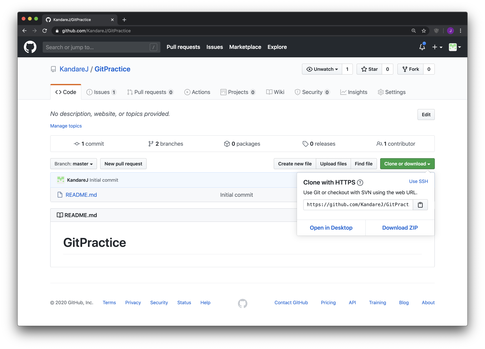
2. Clone the repository using the command `git clone <link>`
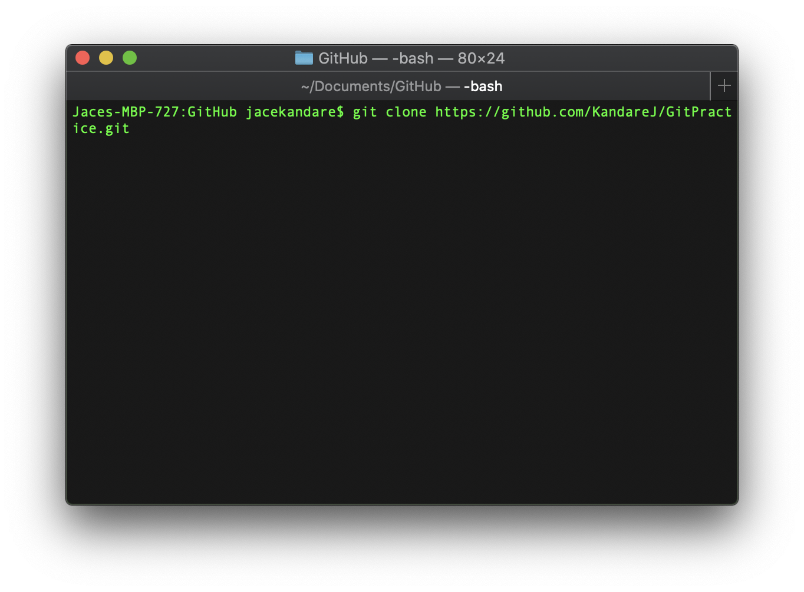
3. Use the command `cd <your repo>`
4. Check the repository's issues, and decide which issue you are going to work on.
5. Type the command `git branch <name of branch>`
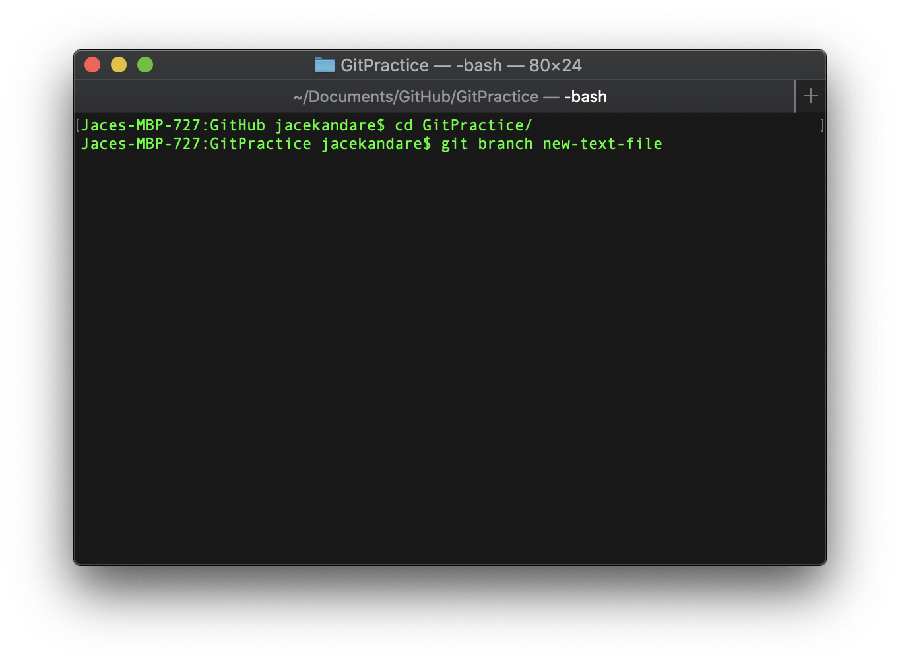
6. Checkout the branch using `git checkout <name of branch>`
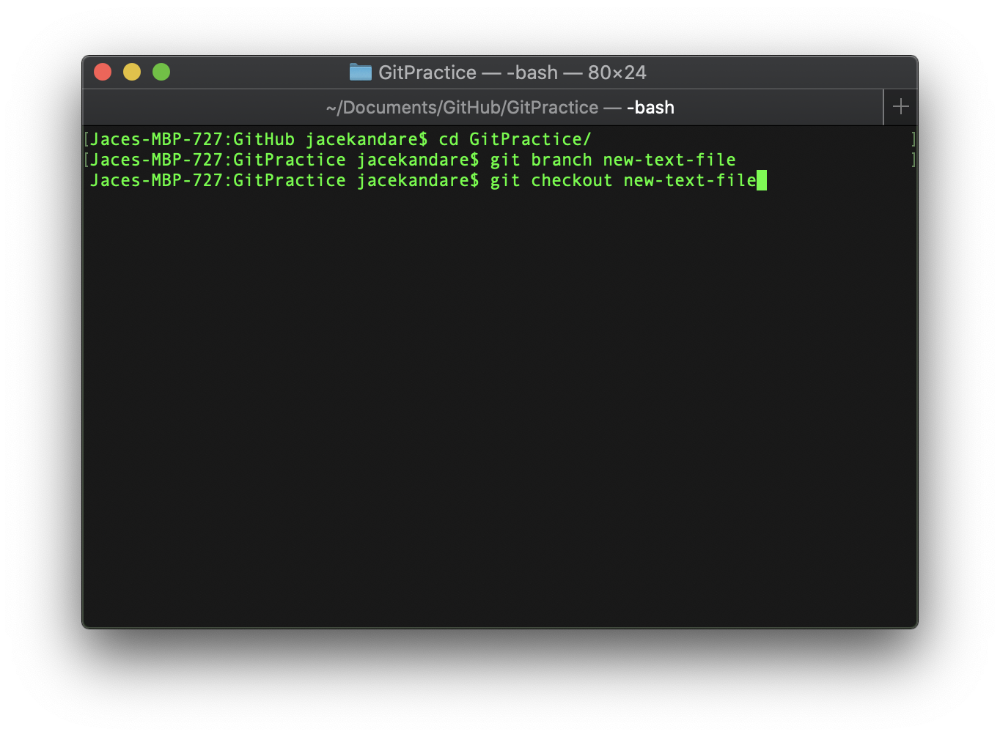
7. Use the command `git pull origin development` because we want to work from the latest version of the development branch.
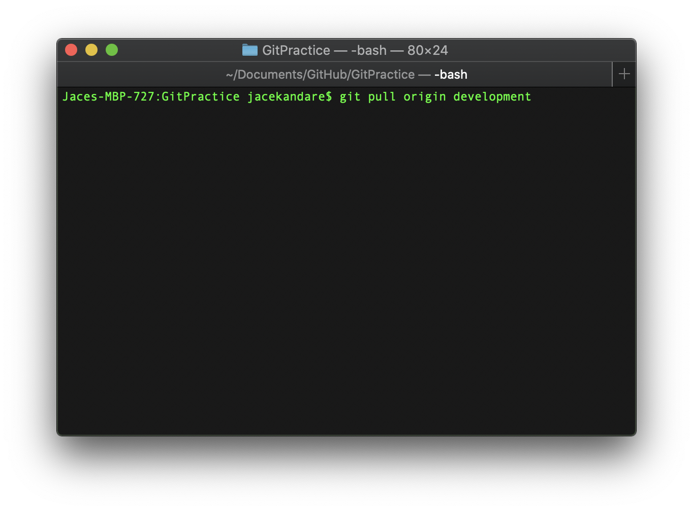
8. Make your changes and add them with `git add <names of edited files>`

9. Use the command `git commit`. This will open up a text editor. Add in a commit message and reference the issue you are working on.
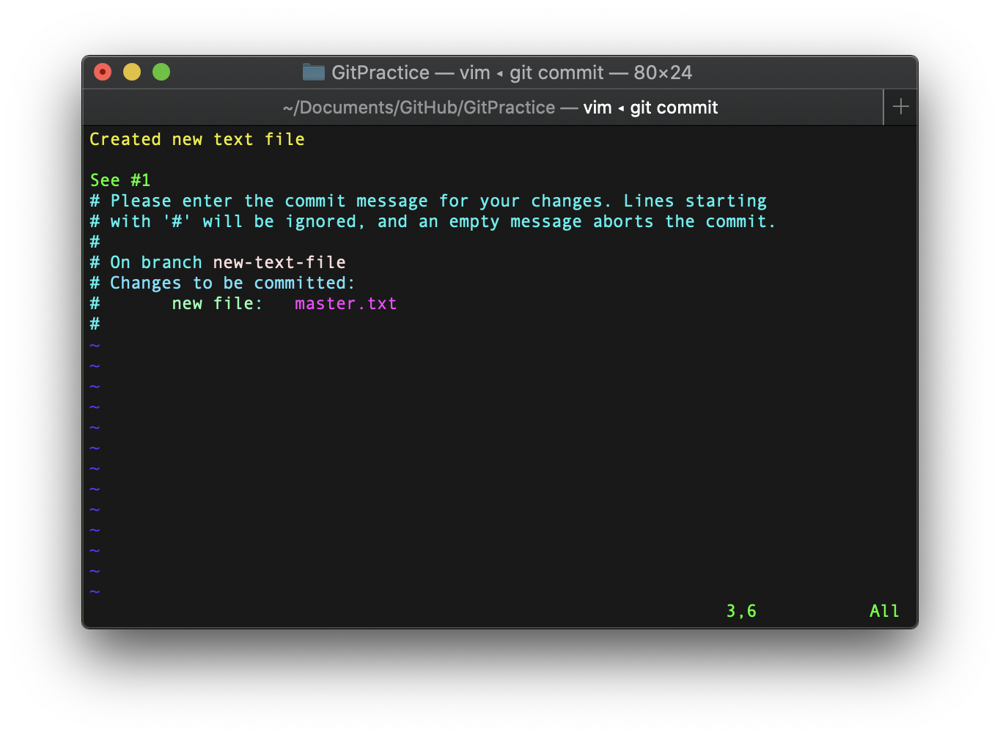
10. Push your changes to the Github repo using the command `git push origin <name of branch>`.
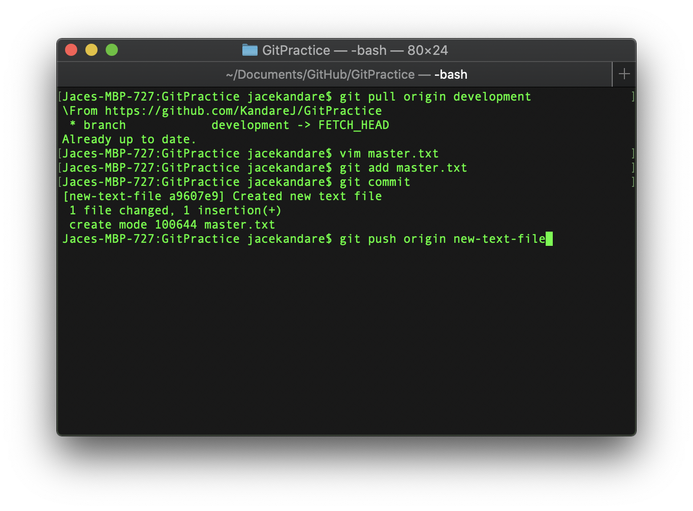
11. Navigate back to your repo. You should see something like this:
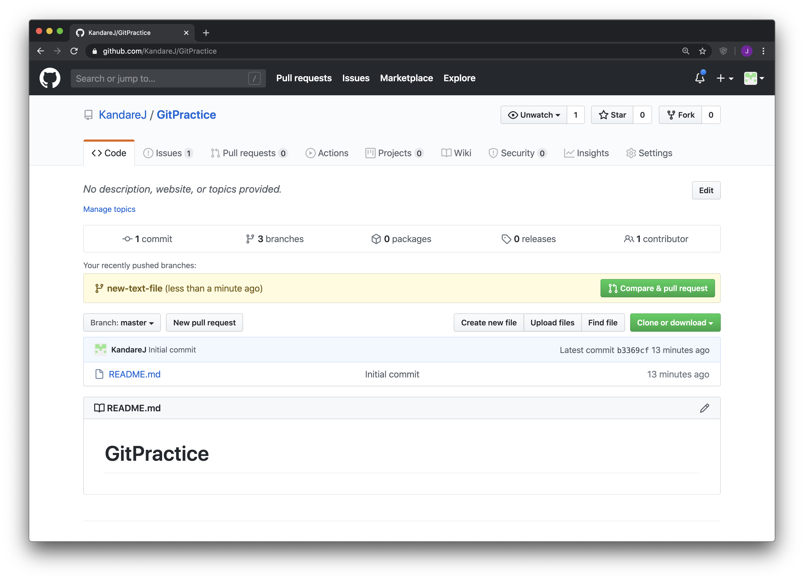
12. Click `Compare & pull request`.
13. Switch the branch to development, and click `Create pull request`.
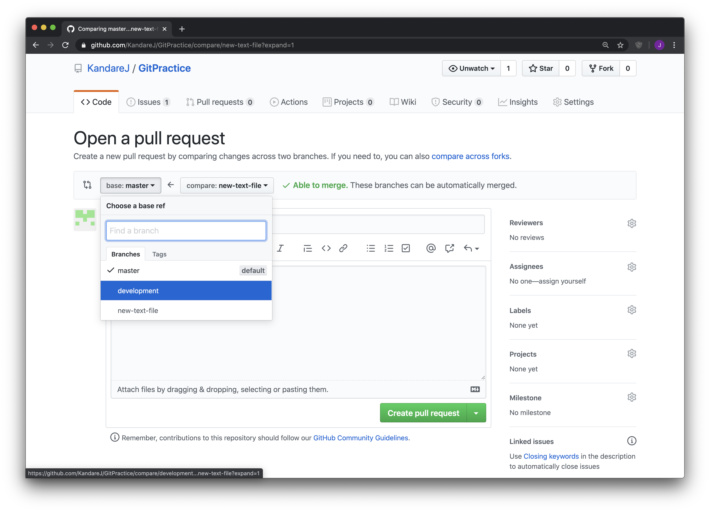
14. After reviewing your changes, click `Merge pull request`
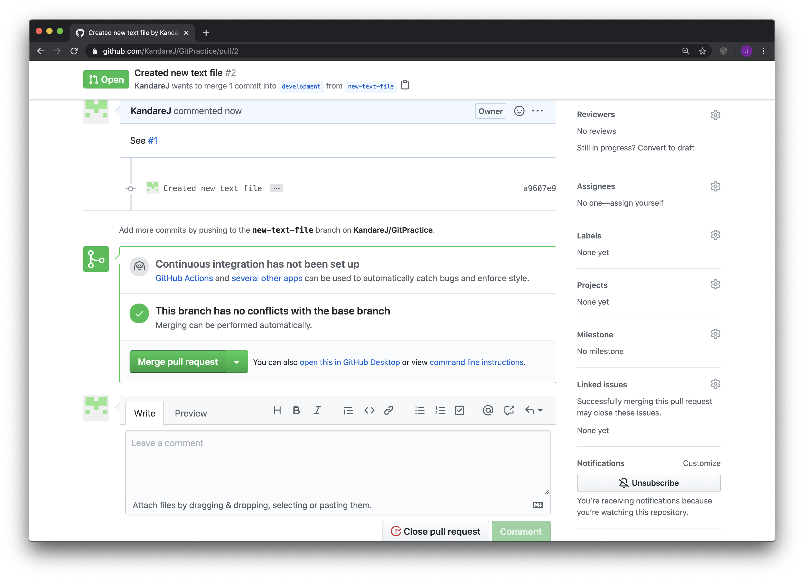
15. Delete your branch off of Github by clicking `Delete branch`
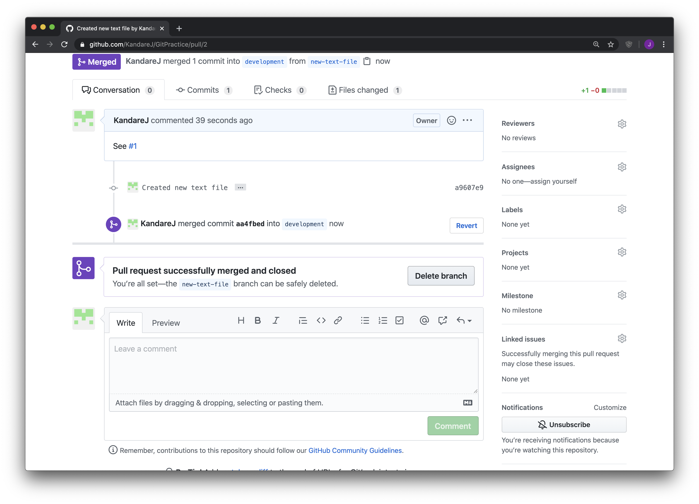
16. Done!
